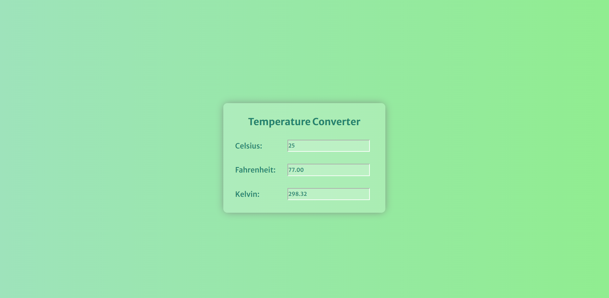

# 🌡️ Temperature Converter Project

## 📌 Project Overview

This project aims to create a **temperature converter** designed for **beginners**. It allows conversion between **Celsius**, **Fahrenheit**, and **Kelvin** temperature units in **real-time**.

## ✨ Features

* 🌡️ Three input fields: **Celsius**, **Fahrenheit**, and **Kelvin**
* 🔄 Real-time temperature conversion: changing celsius input updates the other two instantly
* 📈 Example:

  * Entering 100°C shows 212°F and 373.15 K
  * Entering 100°F shows 37.78°C and 310.93 K

## 🧠 What You'll Learn

* 📍 How to use the `onchange` event listener in JavaScript to detect input changes
* 📍 How to use the `switch` statement to determine which input triggered the update
* 🎨 How to style a project with **modern CSS**, inspired by **Neumorphism** design

## 🛠️ Technologies Used

* **HTML** for structure
* **CSS** with **Newmorphism** design style for modern UI
* **JavaScript** for logic and real-time temperature conversions

## 📚 Concepts Covered

* DOM Manipulation
* `parseFloat()` usage to convert input strings into numbers
* Real-time input tracking using `onchange`
* Conditional logic using `switch` statements
* Bidirectional data syncing between input fields

## 🖼️ Screenshot

## ✅ Summary

This project is perfect for beginners who want to learn **DOM interaction**, **event handling**, and **live data updates** using JavaScript. By the end, you’ll understand how to build a real-time **temperature converter** and style it beautifully with **CSS**.

---
